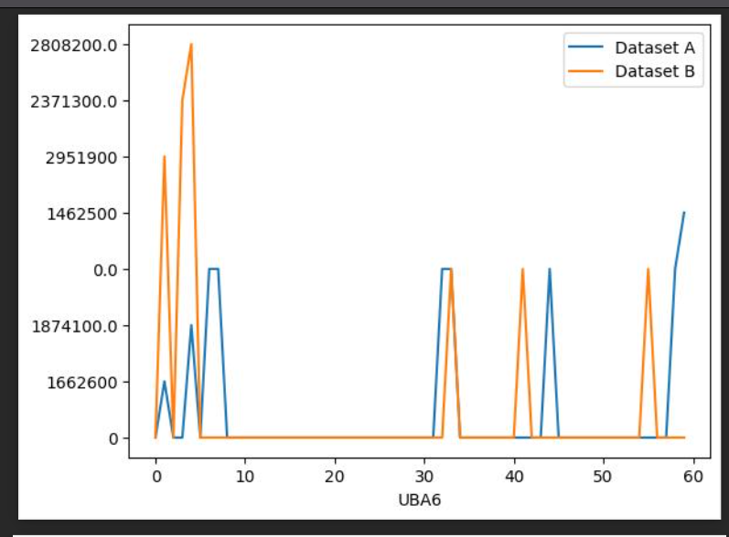

# Migration Profiles
This python script generates migration profiles based on protein abundance distribution. 

It will generate:
- Figures as png 


- CSV Data with the abundance information
```commandline
protein,max_index_a,max_index_b,difference,filename
LINC00493,22,11,11,./figures/LINC00493.png
PIGBOS1,0,0,0,./figures/PIGBOS1.png

```
- All images into a pdf report

## Prerequisite
- Python3
- Pip3

## Installation
1. Clone this repository by using `git clone <repository url>` in the terminal
2. Change into the directory by executing `cd <repo_dir>`
3. Install the dependencies by executing `pip install -r requirements.txt`

## Usage
Please delete files in the `/figures` and `/output` folder if you have used this script earlier.
1. Replace the protein data in the data folder
   1. `data/dataset_a.csv`
   2. `data/dataset_b.csv`
2. In the terminal execute `python main.py`
3. The results are written into
   1. `output/result.csv`
   2. `output/report.pdf`
   3. `figures/`